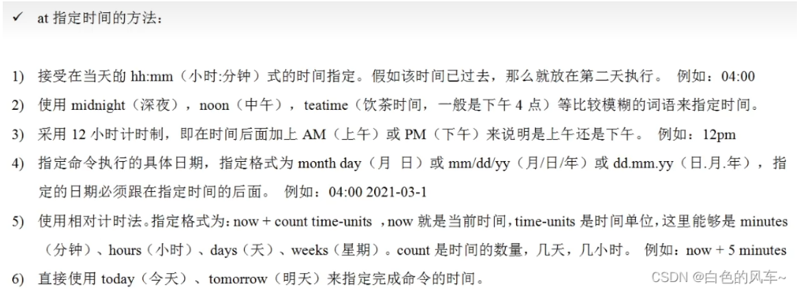
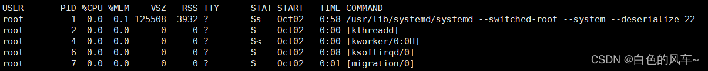

#### linux文件系统
```shell
/root  root的文件
/home  各个用户的文件夹
/bin   系统命令的文件夹  /sbin 管理员的命令
/etc   存放配置文件
/usr   用户安装的程序

/dev  linnux将所有的硬件映射成文件储存在此
/media  自动识别的外设
/mnt   用于挂载外部的文件系统
/boot  启动linux使用的核心文件
/lib  系统开机需要的基本的动态链接共享库
/lost+found  非法关机时的
/proc /srv /sys 系统文件

/temp 存放临时文件
/opt  存放软件的安装程序
/var  存放不断扩充的东西。比如说log

```

#### vim 快捷指令
```shell
复制 yy  复制当前行向下的5行 5yy  粘贴 p
删除 dd  删除向下5行 5dd
查找：命令行下输入 /keyword 回车。 按n查找下一个 
行号 set nu & set nonu
定位首行 gg 末行 G
撤销动作 u 
快速到行号 输入 行号 输入 shift+g
```

#### 关机
```shell
shutdown -h now  现在关机
shutdown -r 1    1min后重启
halt  关机
reboot  重启
sync  把内存里的数据同步到磁盘
```
在shutdown之前都要先进行sync

#### 用户登录与注销
su - 用户名 登录管理员账户   
logout 注销用户。在运行级别3下有效
```shell
useradd 用户名
也可以通过useradd -d 指定目录  新的用户名     来给新创建的用户指定家目录
设置密码  passwd 用户名  
删除用户 保留目录  userdel   用户名
删除用户及目录 userdel  -r 用户名
查询用户信息  id 用户名
切换用户 su - 用户名
添加组 groupadd 组名
useradd -g 用户组 用户名
移动组 usermod -g 组名 用户名

/etc/passwd 文件
每行的含义：用户名：口令：用户标识号：组标识号：注释性描述：主目录：登录Shell
/etc/shadow文件
每行的含义：登录名：加密口令：最后一次修改时间：最小时间间隔：最大时间间隔：警告时间：不活动时间：失效时间：标志
```

#### 实用指令
运行级别说明：
0：关机
1：单用户【找回丢失密码】
2：多用户状态没有网络服务
3：多用户状态有网络服务
4：系统未使用保留给用户
5：图形界面
6：系统重启
常用运行级别是3和5，也可以指定默认运行级别  

```shell
切换运行级别 init 3[123456]
查看当前的运行级别   systemctl get-default
改变默认运行级别   systemctl set-default TARGET.target  TARGET: 你想要的级别

基本语法：man [命令或配置文件]（功能描述：获得帮助信息）
基本语法：help 命令 （功能描述：获得shell内置命令的帮助信息）
```
##### 找回密码


##### 文件
```shell
ls -a
ls -l  以列表的方式显示信息 
ls -lh 以更适合看的形式显示
ll 详细查询所有子文件
tree 目录树

mkdir -p 创建多级目录
删除空目录 rmdir 如果欲删除的目录下有内容则无法删除
创建空文件 touch 文件名称

cd ~ 回到家目录

\cp 强制覆盖，不提示
```

```shell
less filename
下翻页 space/pagedown
上翻页 pageup
向下查找 /字串
向上查找 ?字串
离开 q
```
###### cat
cat只能浏览文件，而不能修改文件，为了浏览方便，一般会带上管道命令 |more
```shell
cat -n /etc/profile |more  -n 显示行号

more快捷键
space 下翻一页
enter 下翻一行
q 离开
ctrl+F 向下滚动一屏
ctrl+B 上一屏
= 输出当前行号
:f 输出文件名
```
more指令是一个基于VI编辑器的文本过滤器，它以全屏幕的方式按页显示文本文件的内容。more指令中内置了若干快捷键（交互的指令）

```shell
head [-n] [-5] filename  输出file的前10(5)行
tail [-n] [-5] filename  后10行(实时监控的，ctrl+c退出)
```
###### 输出，重定向
```shell
echo "hello" 输出到控制台
echo $USER
echo $PATH
echo $HOSTNAME
>覆盖>>追加
ls -al >> lisdir.txt
cat /etc/profile > /etc/myprofile  内容复制。没有目标文件将会创建
```
###### 软连接
功能描述：给原文件创建一个软链接,类似于快捷方式
```shell
基本语法：ln -s [原文件或目录] [软链接名]
```
###### history
```shell
history		  显示所有的历史命令
history 10    显示最近使用过的10个指令	
!5 			  执行历史编号为5的指令	
```
###### 时间和日期
```shell
date				显示当前时间
date +%Y			显示当前年份
date +%m			显示当前月份
date +%d			显示当前是哪一天
date "+%Y-%m-%d %H:%M:%S" 显示年月日时分秒

设置日期
date -s 字符串时间
date -s "2021-6-20 16:44:30"
查看日历
cal [选项]      （功能描述：不加选项，显示本月日历）
cal 2021      显示2021整年的日历
```
###### 查找
```shell
find [搜索范围] [选项]
-name filename
-user username
-size filesize
find / -size +200M  寻找整个系统大于200M的文件  +大于 -小于
快速定位 locate filename  基于数据库的查询，必须先updatedb创建数据库
查询指令所在的文件 which指令

cat /home/hello.txt |grep -n "yes"       hello.txt文件夹中输出同样的
grep -n "yes" /home/hello.txt
-n 输出符号
-i 忽略大小写

```

###### 压缩与解压
```shell
gzip filename  filename-> filename.gz
gunzip filename.gz

zip xx.zip file
zip -r xx.zip folder
unzip xx.zip
unzip -d path xx.zip 解压到指定目录

tar 生成.tar.gz文件
-c  生成.tar 打包文件
-v 显示详细信息
-f 指定压缩后的文件名
-z 打包的同时压缩
-x 解包tar文件
-C 指定解压路径
列出文件：使用“-tvf”选项列出.tar.gz文件中的所有文件。
tar -tvf archive.tar.gz
-t：列出归档文件中的内容。
添加文件：使用“-rvf”选项将文件添加到现有的.tar.gz文件中。
tar -rvf archive.tar.gz file.txt
-r：向现有的归档文件添加文件。

```

### 组管理和权限管理
```shell
ls -ahl 查看文件所有者
chown [-r] username filename 改变文件所有者，，不会改变组
chgrp [r] groupname filename  改变文件所在组
chown newowner:newgroup filename 同时改变组与用户
```
-rw-r--r--说明
```
第0位 文件类型
l是链接
    d是目录
    c是字符设备文件，如鼠标/键盘
    b是块设备，如硬盘
    - 是文件
第1~3位 文件所有者的权限
第4~6位 同组用户的权限
第7~9位 其他组用户的权限
```
##### rwx
* rwx作用于文件
r代表可读
w代表可写 (不代表可删除，可删除文件的前提是对此文件所在目录具有写权限)
x代表可执行
* rwx作用于目录
r代表可读，可以使用ls查看目录内容
w代表可写，可以修改。可在目录内创建+删除+重命名目录
x代表可执行，即可以进入该目录
#### 修改权限
```shell
1. 通过+ - =
u owner, g group, o else, a all user
chmod u=rwx,g=rx,o=x file
chmod o+w file
chmod a-x file
2. 通过数字
r=4 w=2 x=1
chmod 751 file (等价于u=rwx,g=rx,o=x)

```
### 定时任务调度
#### crontab循环定时任务
```shell
crontab []
-e 编辑定时任务
-l 查询定时任务
-r 删除当前用户所有的crontab任务
service crond restart 重启任务调度
```
任务调度文件 : /etc/crontab  
例如：每分钟执行一次 ls -l /etc/ > /tmp/to.txt  
```shell
crontab -e
*/1 * * * * ls -l /etc/ > /tmp/to.txt
```
##### 5个占位符说明
|||
|-----|-----|
第一个*|一小时中的第几分钟
第二个*|一天中的第几小时
第三个*|一月中的第几天
第四个*|年中的地几个月
第五个*|一周中的星期几，0和7代表周日

##### 特殊符号说明
|特殊符号|含义
|-----|-----|
*| 代表任何时间，第一个\*代表一小时的每一分钟
,|代表不连续时间，如 0 8,9 *** 代表每天的第8 9小时的第0分钟
-|连续的时间 0 8-11 *** 每天8-11点的第0分钟
*/n | 每隔多久执行一次 */10 ****  每隔10分钟执行一次

#### at一次性定时任务
使用at时，一定要保证at的守护进程atd的启动(ps -rf | grep atd)
```shell
at [options] [time]
ctrl+d 结束at命令的输入

at [-mldv] TIME
-m 当at工作完成后，即使没有输出信息，也以enail的形式通知用户工作已经完成
-l at -l 相当于atq, 列出目前系统上的所有用户的at调度    
-d at -d 相当于atrm, 可以取消一个在st中的调度
-v：可以使用较明显的时间格式列出at中的任务列表
-c ： 可以列出后面接的该项工作的实际命令内容
-f ： 从文件中读取作业
```


### Linux 磁盘分区、挂载
linux一个目录就对应一个磁盘分区  

查看所有设备挂载情况
```shell
lsblk
lsblk -l
```
增加一块硬盘：
虚拟机添加硬盘
分区
格式化
挂载
设置可以自动挂载
##### 磁盘工作实用指令
```shell
wc命令： word count
-c 统计字节数
-k 统计字符数
-l 统计行数
-w 统计字数 （一个字被定义为由空白、跳格或换行字符分隔的字符串
```

```shell
统计/opt 文件夹下的文件个数
ls -l /opt | grep "^-" | wc -l
统计/opt 文件夹下目录的个数
ls -l /opt | grep "^d" | wc -l
以上写成-lR就是递归统计
```

### 网络配置
#### 设置主机名
修改/etc/hostname 可以指定主机名
修改后重启生效
#### 设置host映射
windows下
在C:\Windows\System32\drivers\etc\hosts文件指定
linux下
在/etc/hosts/文件指定
```shell
ipconfig /displaydns 查看dns域名解析缓存
ipconfig /flushdns 手动清理dns缓存
```
### 进程管理
ps 显示的信息
|字段|说明|
|-----|-----|
PID|进程ID
TTY|终端机号
TIME|进程消耗的CPU时间
CMD|正在执行的命令或进程名

```shell
ps -a显示当前终端所有进程信息
ps -u以用户的形式显示进程信息
ps -x显示后台进程运行的参数
ps -ef  e:显示所有进程 -f 全格式
```


USER:执行进程的用户
PID:进程ID
%CPU:占用CPU的百分比
%MEM:占用物理内存的百分比
VSZ:占用虚拟内存；
包括进程可以访问的所有内存（堆栈），包括进入交换分区的内容，以及共享库占用的内存。
RSS:常驻内存集（Resident Set Size），表示该进程分配的内存大小。
不包括进入交换分区的内存,包括共享库占用的内存（只要共享库在内存中）,包括所有分配的栈内存和堆内存。
TTY:由虚拟控制台、串口以及伪终端设备组成的终端设备；终端名称
STAT:进程状态；S->sleep，R->running/runable等等
linux进程查看中STAT的含义
START:启动时间
TIME：占用的CPU时间
COMMAND:进程名/执行该进程时的指令

pstree 进程树
-p 显示pid
-u 显示所属用户

### 服务进程
服务本质就是后台进程，通常都会监听某个端口，等待其他程序的请求。
比如mysqld,sshd,防火墙等，又称为守护进程

1. service 服务名 [start|stop|restart|reload|status]
2. centOS7后，很多服务使用systemctl
3. service 指令管理的服务在/etc/init.d 查看
```shell
setup 查看全部服务  *代表自启动的服务
ls -l /etc/init.d/ 查看service管理的服务
```
#### 服务的运行级别
* Linux系统的运行级别，见前面
开机->BIOS->/boot->systemd进程1->运行级别->启动此运行级别对应的服务
```shell
设置某个服务在某个运行级别下的自启动开关
chkconfig --list [ | grep xxx ]
chkconfig 服务名 --list
chkconfig --level 5 服务名 on/offf
使用chkconfig后，重启生效
```

```shell
systemctl
在/usr/lib/systemd/system 查看管理的服务
systemctl list-unit-files [|grep 服务名] 查看服务自启动状态
systemctl enable 服务名 设置开机自启动
systemctl disable 服务名 关闭开机自启动
systemctl is-enabled 服务名 查询某个服务是否自启动
systemctl stop/start 临时停止或启动
```
```shell
应用举例
systemctl status firewwalld 查看防护火墙的情况
systemctl stop/restart firewall 关闭/重启

netstat -anp | more 查看网络连接状态
telnet ip port 访问某个ip的某个端口
```

```shell
firewall
firewall-cmd --permanent --add-port = 端口号/协议(打开端口)
firewall-cmd --permanent --remove-port = 端口号/协议(关闭端口)
firewall-cmd --reload(重新载入，设置生效)
firewall-cmd --query-port = 端口号/协议(查询端口情况)
```
##### 动态监控进程
top
-d 秒数  指定top命令每隔几秒更新，默认3秒
-i 不显示闲置/僵死进程
-p 通过ID指定监控进程


load average:负载均衡 三个数的平均值大于70%异常
Tasks: zombie僵死进程，不再有效但仍占用空间
%Cpu: cpu占用情况，us:用户，sy:系统，ni:用户进程空间内改变过优先级的进程占用情况，id:空闲  

交互操作
|操作|功能|
|-----|-----|
P|以CPU使用率排序
M|以内存使用率排序
N|以PID排序
q|退出top

* 监视特定用户
输入top查看执行的进程
然后输入u回车，再输入用户名
* 终止指定进程
输入top查看执行的进程
然后输入k回车，再输入进程ID号
* 指定系统状态更新的时间
top -d 10

##### netstat
```shell
-an 按一定顺序排列输出
-p 显示哪个进程在调用

netstat -anp | grep sshd 查看sshd服务的信息
```

### rpm和yum
```shell
rpm -qa | grep xx查询已安装的rpm列表
name-version-release.os.arch.rpm
软件名称-版本号-发布次数.适合linux系统.硬件平台.rpm

rpm -q 软件包名 (查询软件包是否安装)
rpm -qi 软件包名 (查询软件包信息)
rpm -ql 软件包名 (查询软件包中的文件)
rpm -qf 文件全路径名 (查询文件所属软件包)
rpm -e 软件包名 如果有其它依赖包会有警告
rpm -e --nodeps 包名  无视警告，强制删除

安装rpm包 rpm -ivh 包全路径  要提前下载.rpm文件
i=install 安装
v=verbose 提示
h=hash 进度条
```

```shell
yum list | grep xx
yum install xxx 直接从yum服务器安装
会把所有依赖包一并安装
```
